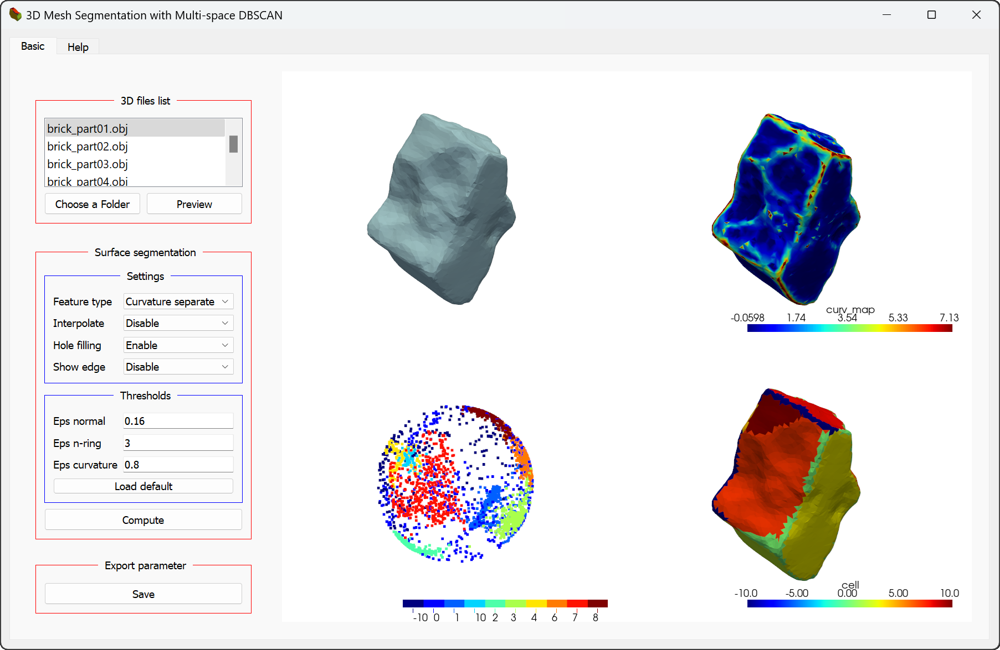

# About the project
This project studies method of rough surface object segmentation using Multi-space DBSCAN (MS-DBSCAN)

In this repository, you can find following folders:

* **evaluation_dataset**: 2 public datasets for benchmarking purposes [with anotated Groundtruth] + 1 real 3D scanned Cultural Heritage dataset (for demonstration purpose)
* **original_dataset**: original datatype of all models within the **evaluation_dataset** folder
* **app + utils**: source code of our framework and utility

To use "3D Mesh Segmentation with Multi-space DBSCAN", you can execute the [pre-build files](https://github.com/nam-usth/MS-DBSCAN/releases), run the source code directly, or build the executable files from the source code.
# How to run MS-DBSCAN from source code
We suggest downloading Anaconda Navigator for your platform (Windows, MacOS, Linux).

From Anaconda's terminal, go into MS-DBSCAN, and run following commands.

`conda create -n ms_dbscan python=3.10`

`conda activate ms_dbscan`

`pip install -r requirements.txt`

`python ./app/GUI_remastered_Qt.py`

# How to use MS-DBSCAN

## Data preparation stage:
1. On the left panel, in the box "3D files list", our tool allows a user to select a dataset folder. The tool automatically loads and displays all the 3D models (with the .obj extension format) inside the browsed directory. 

## Segmentation stage:

2. We reserve the "Surface segmentation" control box on the same panel for the computational settings. 

(a) The user can toggle the Post-processing options in "Settings" resulting in the customize of output visualization. 

(b) The threshold of the mentioned spaces can be adjusted accordingly within the "Thresholds" region. 

(c) Once finished, the user can press the "Compute" button to observe the segmented result.

3. The produced segmented facets will be saved into separated .ply files in the folder named **segmented_result**.

## Preview stage:
4. The system always create a cache to capture the last computed result. Hence, when the user clicks on the same objects next time, all pre-computed results and the threshold will be displayed rapidly. 

5. We also offer a "Save" button in the "Export parameter" to let the user save the carefully chosen thresholds into a .csv file every time he/she segments the same object but with a different set of epsilons.
